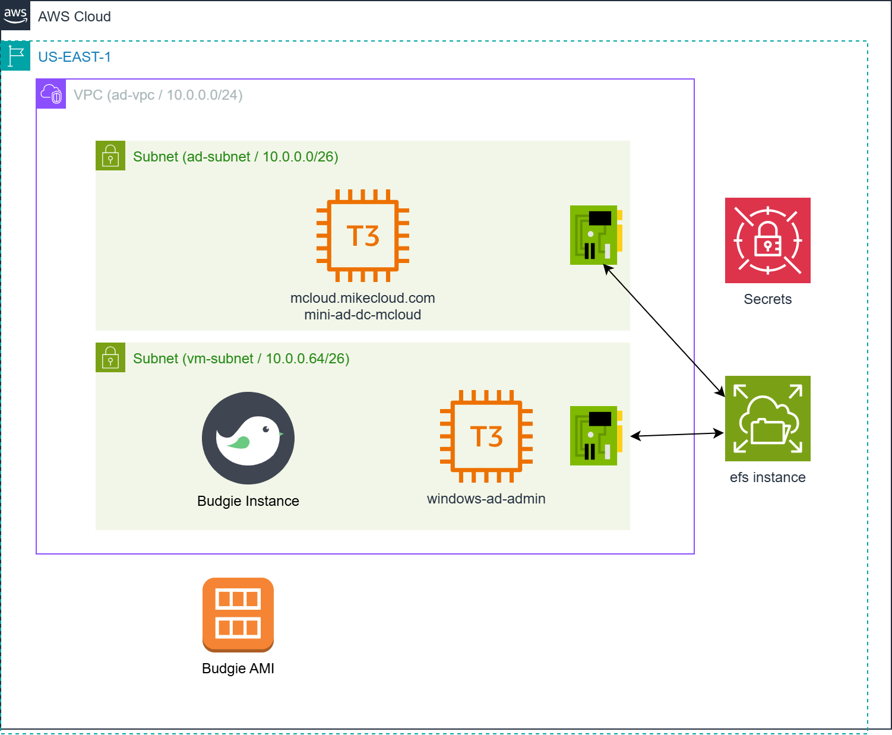

# AWS Budgie XRDP Cloud Development Environment  

This project provides a **complete cloud-based Linux desktop development environment**
powered by **Budgie + XRDP**, **Mini Active Directory**, and **Amazon EFS** running on AWS.

It is designed as a **universal dev workstation image** that contains the full superset
of tools, dependencies, and desktop defaults used across all build projects on my channel.


Instead of repeatedly building and customizing a workstation for each tutorial, demo,
or cloud experiment, this solution fully autobudgies the provisioning of a **ready-to-use,
domain-joined Budgie desktop** with persistent storage and consistent user environments.

## What This Project Builds

1. **A Custom Budgie XRDP AMI (Packer)**
   - Ubuntu-based Budgie desktop optimized for XRDP (X11)
   - Preinstalled developer tools and applications:
     - Chrome, Firefox (deb), VS Code, Docker, Postman, KRDC
   - Cloud tooling included out of the box:
     **Packer, Terraform, Docker CLI, AWS CLI v2, Azure CLI, Google Cloud CLI**
   - Snap-free, clean Budgie desktop with predictable performance
   - XRDP fully configured with Budgie-compatible defaults and fixes
   - Desktop icons, trusted launchers, terminal defaults, and `/etc/skel`
     customizations applied at image build time

2. **A Mini Active Directory Domain (Terraform)**
   - Samba-based Active Directory Domain Controller
   - Domain users generated from a template with randomized credentials
   - Centralized identity for Linux and Windows systems

3. **Domain-Joined Budgie XRDP Desktop Server (Terraform)**
   - Launches Budgie XRDP instances from the custom AMI
   - Automatically joins the Active Directory domain on first boot
   - Consistent user experience via `/etc/skel` provisioning
   - Designed for single-user desktops or expandable pools

4. **Amazon EFS for Persistent Home Directories**
   - Linux desktops mount EFS over NFS
   - Centralized, durable, and scalable home directories
   - Ideal for rebuilds, multi-instance demos, or short-lived labs

The result is a **disposable, reproducible, cloud-hosted Budgie desktop environment**
that can be launched in minutes and reused across **any automation, infrastructure,
or cloud engineering project** featured on the channel.



## Prerequisites

* [An AWS Account](https://aws.amazon.com/console/)
* [Install AWS CLI](https://docs.aws.amazon.com/cli/latest/userguide/getting-started-install.html) 
* [Install Terraform](https://developer.hashicorp.com/terraform/install)
* [Install Packer](https://developer.hashicorp.com/packer/install)

If this is your first time watching our content, we recommend starting with this video: [AWS + Terraform: Easy Setup](https://youtu.be/BCMQo0CB9wk). It provides a step-by-step guide to properly configure Terraform, Packer, and the AWS CLI.

---

## Download this Repository

```bash
git clone https://github.com/mamonaco1973/aws-budgie-xrdp.git
cd aws-budgie-xrdp
```

---

## Build the Code

Run [check_env](check_env.sh) to validate your environment, then run [apply](apply.sh) to provision the infrastructure.

```bash
develop-vm:~/aws-budgie-xrdp$ ./apply.sh
NOTE: Validating that required commands are found in your PATH.
NOTE: aws is found in the current PATH.
NOTE: terraform is found in the current PATH.
NOTE: All required commands are available.
NOTE: Checking AWS cli connection.
NOTE: Successfully logged into AWS.
Initializing the backend...
Initializing provider plugins...
- Reusing previous version of hashicorp/random from the dependency lock file
- Reusing previous version of hashicorp/aws from the dependency lock file
- Using previously-installed hashicorp/random v3.7.1
- Using previously-installed hashicorp/aws v5.89.0

Terraform has been successfully initialized!

You may now begin working with Terraform. Try running "terraform plan" to see
any changes that are required for your infrastructure. All Terraform commands
should now work.
```
---
### Build Results

When the deployment completes, the following resources are created:

- **Networking:**  
  - A dedicated VPC with public and private subnets  
  - Internet Gateway and optional NAT Gateway for controlled outbound access  
  - Route tables configured to support AD, EFS, and the **Budgie XRDP** servers  

- **Security & IAM:**  
  - Security groups for the domain controller, Budgie XRDP Linux desktops,
    optional Windows admin server, and EFS  
  - IAM roles and policies allowing EC2 instances to:  
    - Retrieve Active Directory credentials from **AWS Secrets Manager**  
    - Mount Amazon EFS via NFS  
    - Perform secure instance bootstrapping without hard-coded secrets  
  - AD administrator and autogenerated domain user credentials stored securely
    in **AWS Secrets Manager**  

- **Active Directory Server:**  
  - Ubuntu-based EC2 instance running **Samba 4** as the Domain Controller and DNS server  
  - Configured Kerberos realm, DNS zone, and NetBIOS name  
  - Domain users generated from a template with randomized passwords and stored in
    Secrets Manager  

- **Amazon EFS:**  
  - Elastic File System deployed with mount targets across private subnets  
  - Security groups allowing NFS traffic (TCP/2049) from all Budgie XRDP servers  
  - Provides shared, persistent home directories for all Linux desktop instances  

- **Packer-Built Budgie XRDP AMI:**  
  - Custom AMI containing:  
    - Ubuntu Budgie desktop and XRDP (X11)  
    - Chrome, Firefox (deb), Visual Studio Code  
    - Development tooling: **Packer, Terraform, Docker CLI, AWS CLI v2,
      Azure CLI, Google Cloud CLI**  
    - KRDC, Postman, and all channel-wide prerequisites  
  - `/etc/skel` preconfigured with trusted desktop launchers, terminal defaults,
    wallpaper, and user environment settings  
  - All Budgie-specific XRDP fixes applied (session startup, launcher trust,
    desktop integration, and terminal behavior)  

- **Linux Desktop Instances (Budgie XRDP):**  
  - EC2 instances launched from the custom Budgie XRDP AMI  
  - Automatically joined to Active Directory using credentials retrieved from
    Secrets Manager  
  - Home directories mounted from Amazon EFS via NFS  
  - Ready-to-use, domain-authenticated cloud development desktops  

- **Windows Admin Server (Optional):**  
  - Domain-joined Windows Server for RSAT, ADUC, and DNS management tools  
  - Useful for directory validation, troubleshooting, and Windows-based demos  

---

### Users and Groups

As part of this project, when the domain controller is provisioned, a set of sample **users** and **groups** are automatically created through Terraform-provisioned scripts running on the mini-ad server. These resources are intended for **testing and demonstration purposes**, showcasing how to autobudgie user and group provisioning in a self-managed Active Directory environment.


#### Groups Created

| Group Name    | Group Category | Group Scope | gidNumber |
|---------------|----------------|-------------|-----------|
| mcloud-users  | Security       | Universal   | 10001     |
| india         | Security       | Universal   | 10002     |
| us            | Security       | Universal   | 10003     |
| linux-admins  | Security       | Universal   | 10004     |

#### Users Created and Group Memberships

| Username | Full Name   | uidNumber | gidNumber | Groups Joined                    |
|----------|-------------|-----------|-----------|-----------------------------------|
| jsmith   | John Smith  | 10001     | 10001     | mcloud-users, us, linux-admins    |
| edavis   | Emily Davis | 10002     | 10001     | mcloud-users, us                  |
| rpatel   | Raj Patel   | 10003     | 10001     | mcloud-users, india, linux-admins |
| akumar   | Amit Kumar  | 10004     | 10001     | mcloud-users, india               |

---

#### Understanding `uidNumber` and `gidNumber` for Linux Integration

The **`uidNumber`** (User ID) and **`gidNumber`** (Group ID) attributes are critical when integrating **Active Directory** with **Linux systems**, particularly in environments where **SSSD** ([System Security Services Daemon](https://sssd.io/)) or similar services are used for identity management. These attributes allow Linux hosts to recognize and map Active Directory users and groups into the **POSIX** (Portable Operating System Interface) user and group model.


### Creating a New Desktop User

Follow these steps to provision a new user in the Active Directory domain and validate their access to the Desktop.

1. **Connect to the Domain Controller**  
   - Log into the **`windows-ad-admin`** server via Remote Desktop (RDP).  
   - Use the `rpatel` or `jsmith` credentials that were provisioned during cluster deployment.  

2. **Launch Active Directory Users and Computers (ADUC)**  
   - From the Windows Start menu, open **“Active Directory Users and Computers.”**  
   - Enable **Advanced Features** under the **View** menu. This ensures you can access the extended attribute tabs (e.g., UID/GID mappings).  

3. **Navigate to the Users Organizational Unit (OU)**  
   - In the left-hand tree, expand the domain (e.g., `mcloud.mikecloud.com`).  
   - Select the **Users** OU where all cluster accounts are managed.  

4. **Create a New User Object**  
   - Right-click the Users OU and choose **New → User.**  
   - Provide the following:  
     - **Full Name:** Descriptive user name (e.g., “Mike Cloud”).  
     - **User Logon Name (User Principal Name / UPN):** e.g., `mcloud@mcloud.mikecloud.com`.  
     - **Initial Password:** Set an initial password.


5. **Assign a Unique UID Number**  
   - Open **PowerShell** on the AD server.  
   - Run the script located at:  
     ```powershell
     Z:\efs\aws-budgie-xrdp\04-utils\getNextUID.bat
     ```  
   - This script returns the next available **`uidNumber`** to assign to the new account.  

6. **Configure Advanced Attributes**  
   - In the new user’s **Properties** dialog, open the **Attribute Editor** tab.  
   - Set the following values:  
     - `gidNumber` → **10001** (the shared GID for the `mcloud-users` group).  
     - `uid` → match the user’s AD login ID (e.g., `rpatel`).  
     - `uidNumber` → the unique numeric value returned from `getNextUID.ps1`.  

7. **Add Group Memberships**  
   - Go to the **Member Of** tab.  
   - Add the user to the following groups:  
     - **mcloud-users** → grants standard Desktop access.  
     - **us** (or other geographic/departmental group as applicable).  

8. **Validate User on Linux**  
   - Open an **AWS Systems Manager (SSM)** session to the **`BUDGIE-instance`** instance.  
   - Run the following command to confirm the user’s identity mapping:  
     ```bash
     id mcloud
     ```  
   - Verify that the output shows the correct **UID**, **GID**, and group memberships (e.g., `mcloud-users`).  


9. **Validate Desktop Access**  
   - Open the a RDP session to the desktop environment
   - Log in with the new AD credentials.  


### Clean Up Infrastructure  

When you are finished testing, you can remove all provisioned resources with:  

```bash
./destroy.sh
```

This will use Terraform to delete the VPC, EC2 instances, IAM roles, security groups, and any other infrastructure created by the project. Secrets stored in AWS Secrets Manager will also be deleted unless retention policies are configured.
